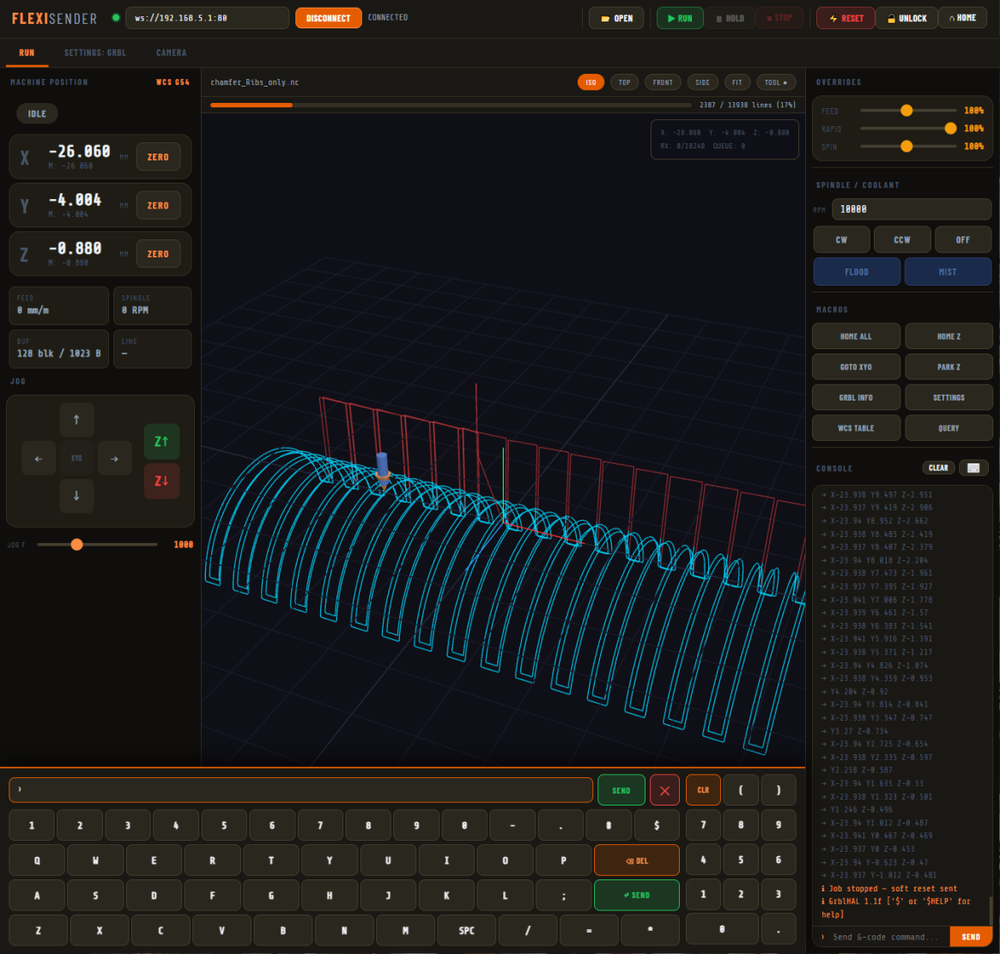

# FlexiSender

A browser-based GrblHAL sender with a live 3D toolpath visualizer, built as a single self-contained HTML file. No installation, no server, no dependencies - open it and connect.



---

## Features

### Connection
- Connects to GrblHAL controllers over WebSocket (`ws://host:port`)
- Auto-detects controller capabilities via `$I+` on connect - axis count, RX buffer size, available features
- Parses `[OPT:]` to configure the streaming engine for your specific firmware build

### Streaming Engine
FlexiSender uses **IOSender-compatible character-counting (aggressive) buffering** - the same method used by IOSender's "Aggressive Buffering" mode. Rather than waiting for one `ok` before sending the next line, it tracks the exact byte occupancy of the controller's RX buffer and keeps it saturated at all times. This eliminates planner starvation on fast or short-move programs.

- Byte-accurate RX buffer tracking using a FIFO send queue
- Auto-detects buffer size from `[OPT:]` - works with 128B, 256B, or larger buffers
- Real-time commands (`?`, `!`, `~`, `\x18`) bypass the buffer and are never counted
- Stream halts on error with the offending line clearly identified in the console

### 3D Toolpath Visualizer
- **Cyan** = cutting moves (G1), **red** = rapids (G0), **green** = executed path
- Animated tool marker tracks live machine position from status reports
- Orbit (left-drag), pan (right-drag), zoom (scroll)
- ISO / TOP / FRONT / SIDE preset views, plus **FIT** to auto-frame the loaded file
- Toolpath parsed directly in the browser - no server-side processing

### Settings: GrblHAL Tab
FlexiSender implements GrblHAL's native settings enumeration protocol, exactly as IOSender does.

On clicking **READ FROM CONTROLLER**, it runs a three-phase load:
1. `$EG` - fetches the full hierarchical settings group tree
2. `$ESH` + `$ES` - fetches all setting definitions with names, units, datatypes, format strings, and full descriptions in a single burst
3. `$$` - fetches all current values

Settings are rendered with **correct widgets per datatype**:
- Boolean → ON / OFF toggle
- Bitfield → labeled checkboxes (one per bit, `N/A` entries skipped)
- Exclusive bitfield → checkboxes where bit 0 enables the rest
- Radio buttons → exclusive option select
- Axis mask → per-axis checkboxes, sized to your machine's actual axis count
- Integer / Decimal → numeric input with range shown
- String / Password / IPv4 → appropriate input type

Descriptions support `\n` newlines as GrblHAL encodes them - multi-line descriptions render properly. Dirty settings are highlighted in yellow. Write individually or batch-write all changes at once.

### Other Controls
- Jog panel with XY arrow pad, Z up/down, five step sizes, and adjustable feed rate
- Zero X / Y / Z / All buttons
- Feed, rapid, and spindle override sliders
- Spindle CW / CCW and coolant on/off
- Macro buttons for common commands
- Timestamped console with TX/RX log and command history (↑/↓)

---

## Usage

1. Download `flexisender.html`
2. Serve it locally (required to avoid mixed-content blocking on `ws://`):
   ```bash
   python3 -m http.server 8080
   ```
3. Open `http://localhost:8080/grblhal-sender-3d.html`
4. Enter your controller's WebSocket address and click **CONNECT**

To bundle Three.js for fully offline use:
```bash
python3 -c "
import urllib.request
html = open('grblhal-sender-3d.html').read()
three = urllib.request.urlopen('https://cdnjs.cloudflare.com/ajax/libs/three.js/r128/three.min.js').read().decode()
html = html.replace('<script src=\"https://cdnjs.cloudflare.com/ajax/libs/three.js/r128/three.min.js\"></script>', f'<script>{three}</script>')
open('flexisender-offline.html', 'w').write(html)
"
```

---

## Requirements

- A GrblHAL controller with WebSocket support (ESP32-based boards, FluidNC, Teensy with networking)
- Any modern browser (Chrome, Firefox, Edge, Safari)
- GrblHAL firmware build date ≥ 20210819 for full settings enumeration support

---

## License

MIT
